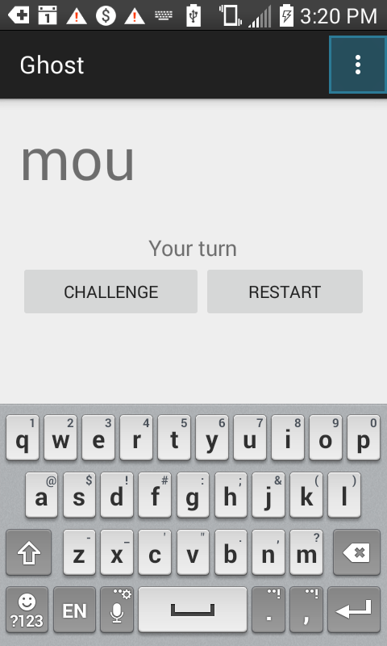
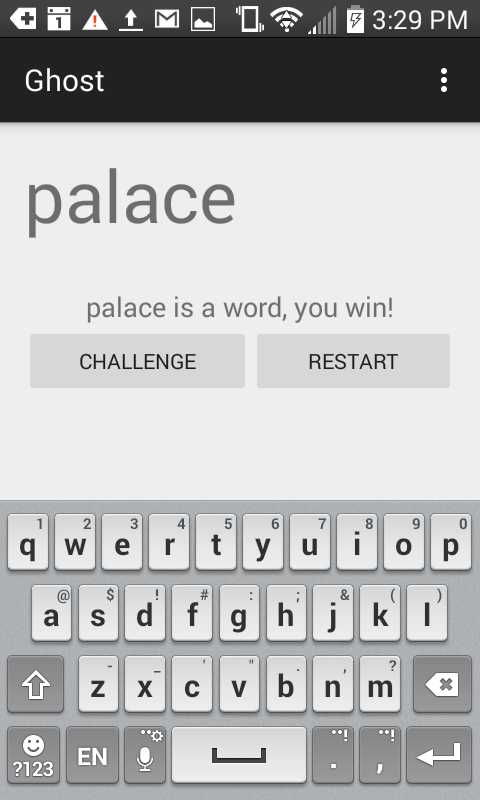
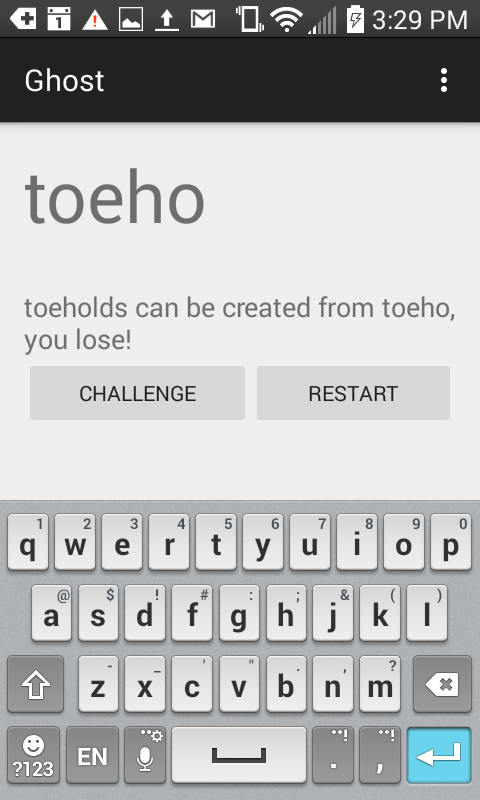
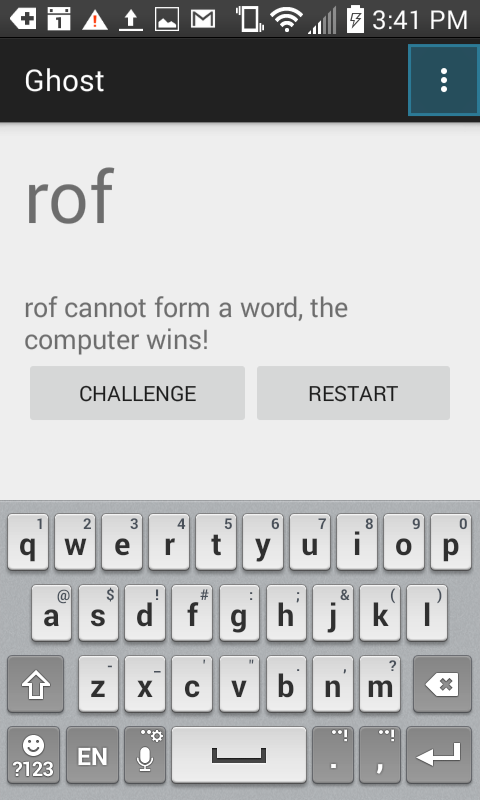

# ghost-android-v2
Same as [ghost-android](https://github.com/CWolfAnderson/ghost-android) but implements a faster dictionary using a trie. It also picks a random word that matches the prefix instead of the first word that matches it.

"Ghost is a written or spoken word game in which players take turns adding letters to a growing word fragment, trying not to be the one to complete a valid word. Each fragment must be the beginning of an actual word, and usually some minimum is set on the length of a word that counts, such as three or four letters." - [Wikipedia](https://en.wikipedia.org/wiki/Ghost_(game))

## Screenshots:

